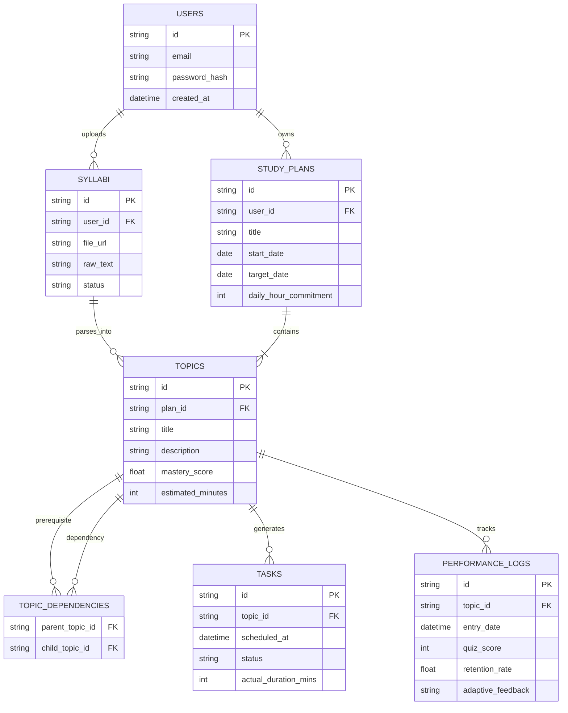

```mermaid
erDiagram

    USERS ||--o{ SYLLABI : uploads
    USERS ||--o{ STUDY_PLANS : owns

    SYLLABI ||--o{ TOPICS : parses_into

    STUDY_PLANS ||--|{ TOPICS : contains

    TOPICS ||--o{ TOPIC_DEPENDENCIES : prerequisite
    TOPICS ||--o{ TOPIC_DEPENDENCIES : dependency

    TOPICS ||--o{ TASKS : generates
    TOPICS ||--o{ PERFORMANCE_LOGS : tracks

    USERS {
        string id PK
        string email
        string password_hash
        datetime created_at
    }

    SYLLABI {
        string id PK
        string user_id FK
        string file_url
        string raw_text
        string status
    }

    STUDY_PLANS {
        string id PK
        string user_id FK
        string title
        date start_date
        date target_date
        int daily_hour_commitment
    }

    TOPICS {
        string id PK
        string plan_id FK
        string title
        string description
        float mastery_score
        int estimated_minutes
    }

    TOPIC_DEPENDENCIES {
        string parent_topic_id FK
        string child_topic_id FK
    }

    TASKS {
        string id PK
        string topic_id FK
        datetime scheduled_at
        string status
        int actual_duration_mins
    }

    PERFORMANCE_LOGS {
        string id PK
        string topic_id FK
        datetime entry_date
        int quiz_score
        float retention_rate
        string adaptive_feedback
    }
```
