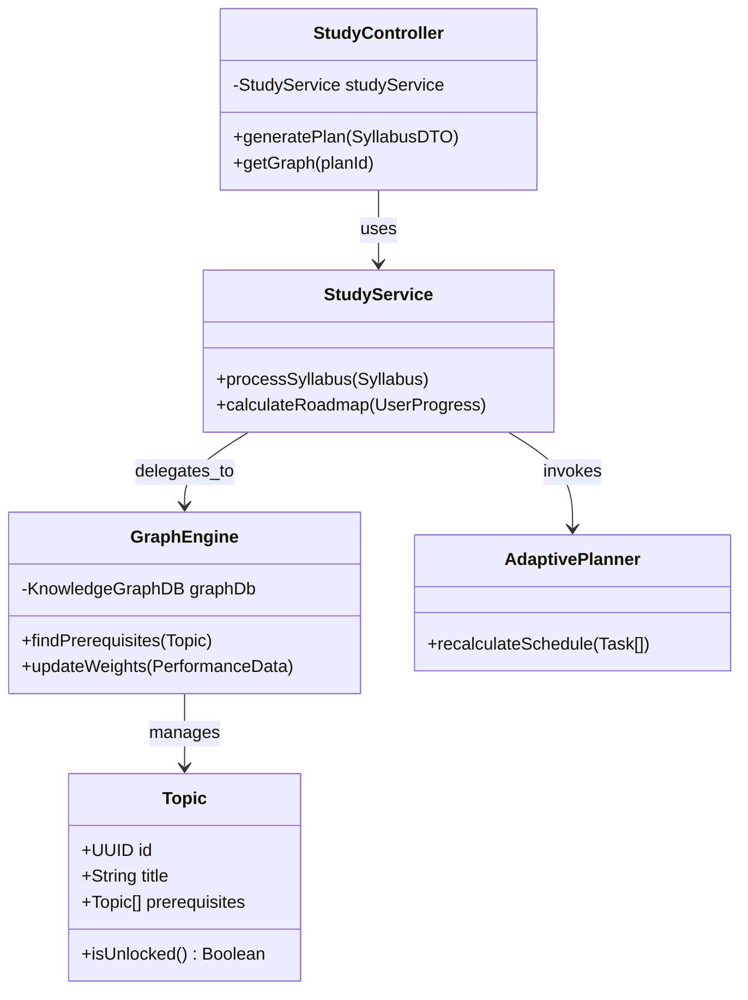

```mermaid
classDiagram

    class StudyController {
        -StudyService studyService
        +generatePlan(SyllabusDTO)
        +getGraph(planId)
    }

    class StudyService {
        +processSyllabus(Syllabus)
        +calculateRoadmap(UserProgress)
    }

    class GraphEngine {
        -KnowledgeGraphDB graphDb
        +findPrerequisites(Topic)
        +updateWeights(PerformanceData)
    }

    class Topic {
        +UUID id
        +String title
        +Topic[] prerequisites
        +isUnlocked() Boolean
    }

    class AdaptivePlanner {
        +recalculateSchedule(Task[])
    }

    StudyController --> StudyService : uses
    StudyService --> GraphEngine : delegates_to
    StudyService --> AdaptivePlanner : invokes
    GraphEngine --> Topic : manages
```
