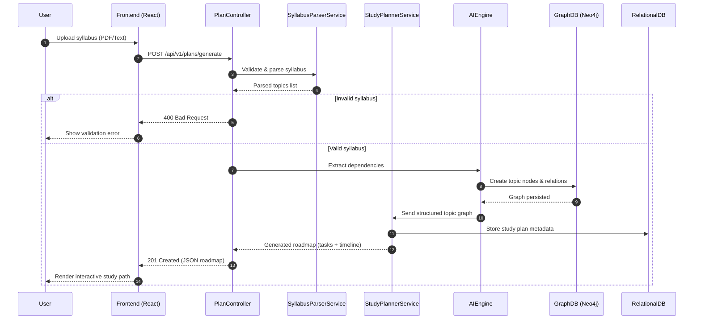

```mermaid
sequenceDiagram
autonumber

%% Actors & Layers
participant User
participant UI as Frontend (React)
participant API as PlanController
participant Parser as SyllabusParserService
participant Planner as StudyPlannerService
participant AI as AIEngine
participant Graph as GraphDB (Neo4j)
participant DB as RelationalDB

%% Upload Flow
User->>UI: Upload syllabus (PDF/Text)
UI->>API: POST /api/v1/plans/generate

%% Validation Layer
API->>Parser: Validate & parse syllabus
Parser-->>API: Parsed topics list

alt Invalid syllabus
API-->>UI: 400 Bad Request
UI-->>User: Show validation error
else Valid syllabus

%% Knowledge Graph Creation
API->>AI: Extract dependencies
AI->>Graph: Create topic nodes & relations
Graph-->>AI: Graph persisted

%% Planning Engine
AI->>Planner: Send structured topic graph
Planner->>DB: Store study plan metadata
Planner-->>API: Generated roadmap (tasks + timeline)

%% Response
API-->>UI: 201 Created (JSON roadmap)
UI-->>User: Render interactive study path

end
```
