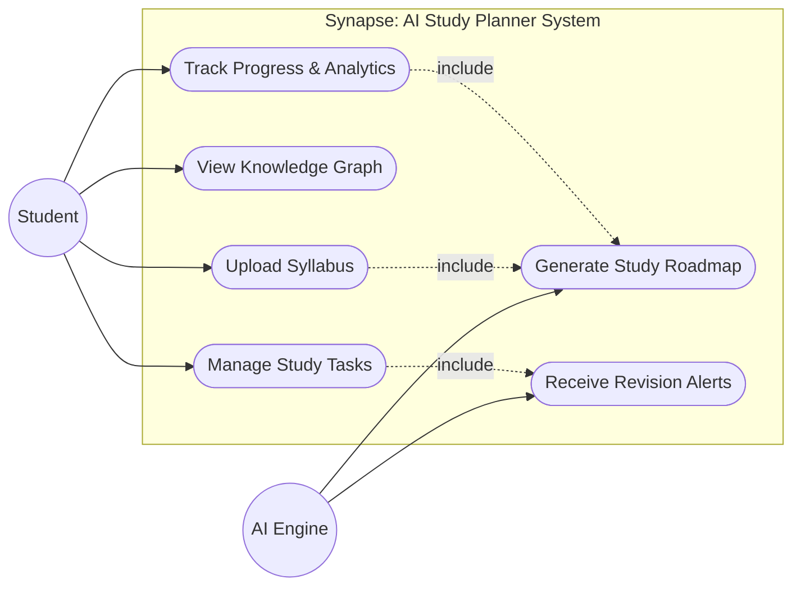

```mermaid
flowchart LR

%% Actors
Student((Student))
AI((AI Engine))

%% System Boundary
subgraph Synapse_System["Synapse: AI Study Planner System"]

UC1([Upload Syllabus])
UC6([Generate Study Roadmap])
UC2([View Knowledge Graph])
UC3([Manage Study Tasks])
UC4([Receive Revision Alerts])
UC5([Track Progress & Analytics])

end

%% Actor interactions
Student --> UC1
Student --> UC2
Student --> UC3
Student --> UC5

AI --> UC6
AI --> UC4

%% Use-case relationships
UC1 -. include .-> UC6
UC3 -. include .-> UC4
UC5 -. include .-> UC6
```
